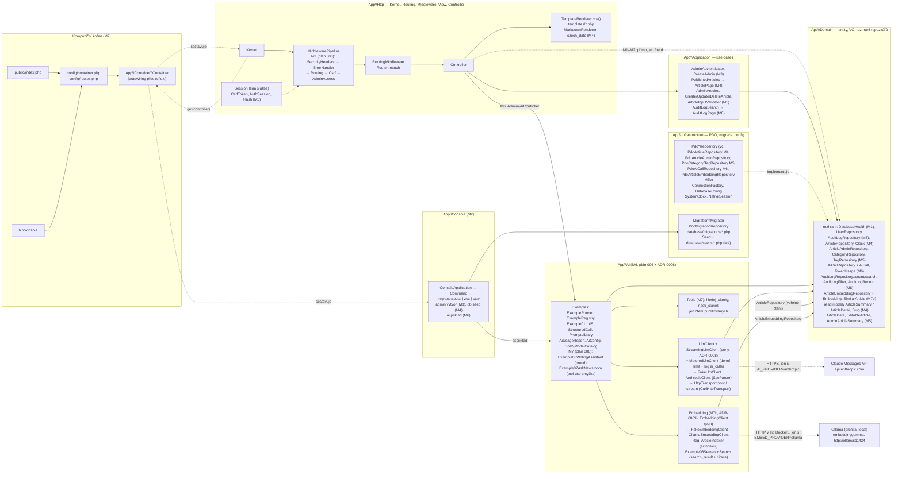
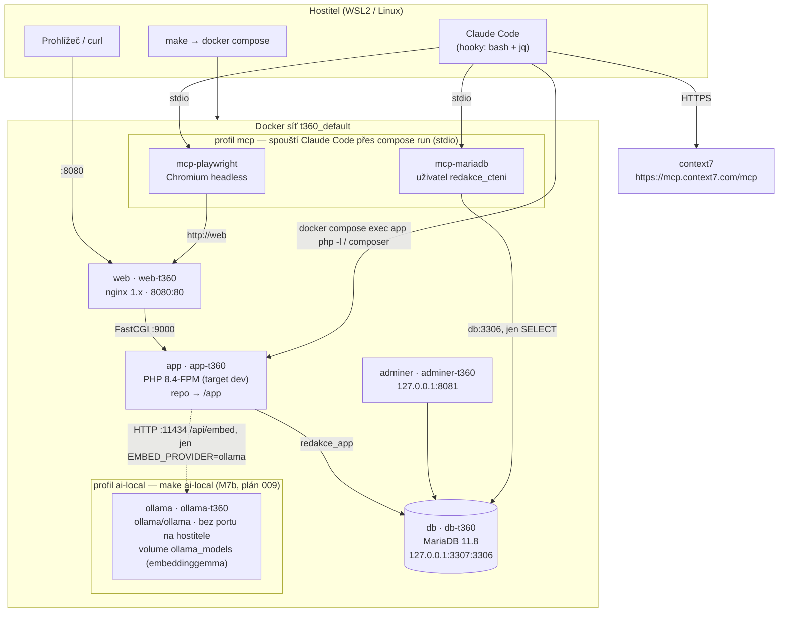
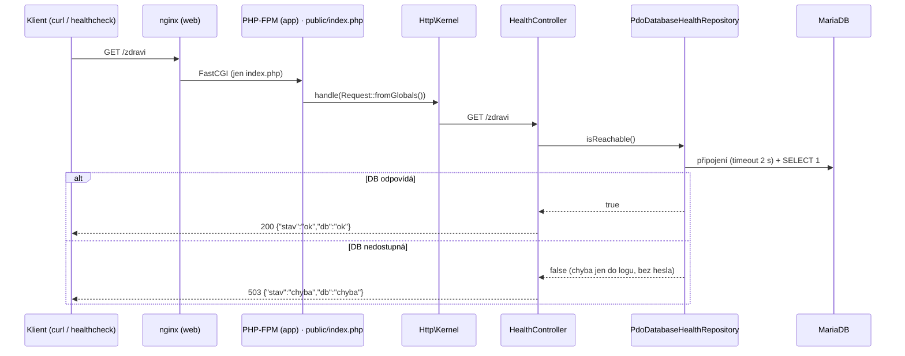
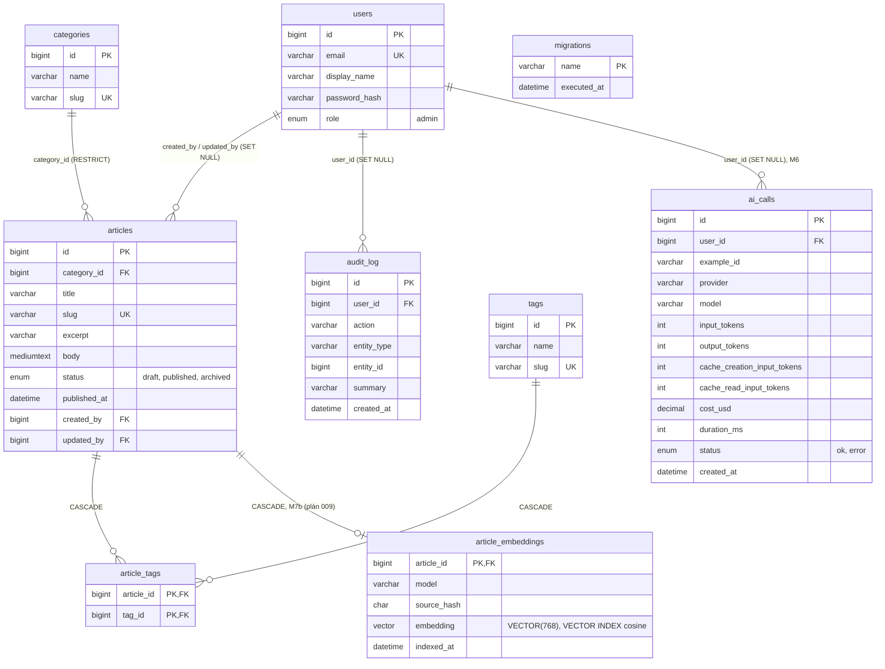

# Architektura — Redakční systém (t360)

> Udržuje agent `architekt`. Poslední aktualizace: 2026-10-08 (plány 001–004, M1–M4 — hotovo;
> plán 005 M5 administrace článků — implementováno; plán 006 M6 AI jádro — hotovo;
> plán 007 M8 audit log, opravy, tutoriál — implementováno; plán 008 M7 příklady 06–07 — hotovo;
> plán 009 M7b příklad 08 RAG — návrh).
> Rozhodnutí: [ADR-0001](adr/0001-vyvoj-tymem-agentu.md) tým agentů ·
> [ADR-0002](adr/0002-vse-v-dockeru-vcetne-mcp.md) vše v Dockeru vč. MCP ·
> [ADR-0003](adr/0003-anglicke-identifikatory.md) anglické identifikátory ·
> [ADR-0004](adr/0004-anglicke-nazvy-v-databazi.md) anglické názvy v DB ·
> [ADR-0005](adr/0005-vlastni-markdown-renderer.md) vlastní Markdown renderer ·
> [ADR-0006](adr/0006-vlastni-llm-klient-curl.md) vlastní LLM klient přes cURL ·
> [ADR-0007](adr/0007-casy-v-databazi-utc-vs-praha.md) časy v DB: UTC vs. Europe/Prague (navrženo) ·
> [ADR-0008](adr/0008-streaming-a-nastroje-llm.md) streaming a tool use v LLM klientovi ·
> [ADR-0009](adr/0009-semanticke-vyhledavani-embeddingy-a-citace.md) embeddingy (Ollama), MariaDB VECTOR a citace (navrženo).

## 1. Vrstvy aplikace (cílový stav)
Závislosti míří **dovnitř** k `Domain`. `Infrastructure` implementuje rozhraní z `Domain`.



Stav po M1: `Kernel` s pevně zadrátovanou cestou `/zdravi`, rozhraní `Domain\Health\DatabaseHealth`
a jeho PDO implementace. M2 (plán 002) přidal kontejner, router, middleware, šablony, chybové
stránky, konzoli a migrátor. `App\Container` je technické jádro bez závislostí na doméně;
kontejner smí volat jen kompoziční kořen a `Kernel` (dispečer), controllery dostávají závislosti
konstruktorem.

M3 (plán 003, implementováno) — odchylky od zásady „bezp. hlavičky → session → CSRF → autentizace →
autorizace“: párování trasy se přesouvá do `RoutingMiddleware` **před** CSRF (zachová 404/405 pro
neexistující trasy); session není vrstva, ale líná služba (`Http\Session\Session`, implementace
`Infrastructure\Session\NativeSession`) — veřejné stránky nedostanou cookie; autentizace a autorizace
jsou jeden `AdminAccessMiddleware` (jediná role `admin`, ochrana podle prefixu `/admin`).

M4 (plán 004, implementováno) — veřejné čtení jde `Controller → PublishedArticles (Application) → ArticleRepository
(Domain) ← PdoArticleRepository`. Pravidlo „veřejně jen publikované a ne budoucí“ je v SQL repozitáře
(metody `*Published*`), čas dodává `Clock` (PHP `Europe/Prague`, ne `NOW()` v MariaDB/UTC). Repozitář
vrací read modely (`ArticleSummary` s rubrikou přes `JOIN`, `ArticleDetail` + štítky druhým dotazem) —
žádné N+1. Controller hlásí 404 výjimkou `Http\PageNotFound`, kterou `ErrorHandlerMiddleware` vykreslí
stejně jako neexistující trasu. Markdown → HTML jen přes `Http\View\MarkdownRenderer` (ADR-0005, jediný
výpis bez `e()` mimo `layout.php`). Seed (`db:seed`) je soubor `database/seeds/demo_content.php` vracející
objekt s rozhraním `Infrastructure\Seed\Seed` — obdoba migrací; běží jako `redakce_app`, nic nemaže.

M5 (plán 005, hotovo) — administrace článků jde `Admin\ArticleController → CreateArticle / UpdateArticle /
DeleteArticle, AdminArticles (Application) → ArticleAdminRepository, CategoryRepository, TagRepository,
AuditLogRepository (Domain) ← Pdo*`. Administrace má **vlastní rozhraní repozitáře** (všechny stavy + zápis),
veřejné `ArticleRepository` zůstává jen pro publikované. Validace formuláře je v `ArticleInputValidator`
(Application, české chyby → `InvalidArticleInput` → 422), slug počítají čisté funkce `Slug::fromText`
a `Slug::uniqueAmong` nad jedním dotazem `takenSlugs`. Článek a jeho štítky se ukládají v transakci
repozitáře, audit `article.*` až po ní. `created_at`/`updated_at` zapisuje repozitář z `Clock` (výchozí
hodnoty DB jsou v UTC). Admin URL používají ID (`/admin/clanky/{id}/upravit`), PRG + `Http\Session\Flash`.

M6 (plán 006, implementováno) — AI jde `Admin\AiController` / `ai:priklad` → `ExampleRunner` → příklad 01–05 →
`LlmClient`. Pod rozhraním `LlmClient` kontejner vždy registruje dekorátor `MeteredLlmClient` (denní limit tokenů
`AI_DENNI_LIMIT_TOKENU` s rezervací `max_tokens`, cena z `config/ai-models.php`, zápis metadat do `ai_calls`) nad
`FakeLlmClient` (bez sítě, výchozí) nebo `AnthropicClient` (cURL přes `HttpTransport`, retry jen 429/500/529).
Strukturovaný výstup přes `output_config.format` + validace v PHP (ADR-0006; vynucený nástroj `claude-sonnet-5-5`
odmítá). Článek jde do promptu v `<clanek>` značkách, výstup modelu se jen zobrazuje přes `e()` a nikam se neukládá;
výsledek přežije PRG v session (`ExampleResultStash`).

M7 (plán 008, hotovo, ADR-0008) — příklad 06 streamuje: `Admin\WritingAssistantController` (POST `/admin/ai/06/proud`
s CSRF) uvolní zámek session a vrátí `Response::stream(producent)`; producent běží až v `Response::send()` (mimo middleware,
chyby mění na SSE `error`) a přes `Example06WritingAssistant` → `StreamingLlmClient` (= `MeteredLlmClient`) → `AnthropicClient`
(`HttpTransport::stream`, `SseParser`) nebo `FakeLlmClient` posílá delty jako SSE (`X-Accel-Buffering: no`); prohlížeč je čte
přes `fetch` (`public/assets/ai-stream.js`), přerušení = `AbortController` → `connection_aborted()` → `stopReason 'aborted'`.
Příklad 07 (PRG jako 01–05) volá `LlmClient::complete()` v smyčce ≤ 5 kroků s nástroji `hledej_clanky`/`nacti_clanek`
(`App\Ai\Tools`, jen `ArticleRepository` = publikované); surové bloky odpovědi (vč. `thinking`) se vracejí nezměněné.
Schéma DB se nemění (krok = řádek `ai_calls`).

M7b (plán 009, **návrh**, ADR-0009) — příklad 08 (sémantické vyhledávání, RAG): `Admin\SemanticSearchController` / `ai:indexuj`
→ `ArticleIndexer` → `EmbeddingClient` (`FakeEmbeddingClient` bez sítě, nebo `OllamaEmbeddingClient` → Ollama `embeddinggemma`
v profilu Compose `ai-local`, HTTP jen uvnitř sítě Dockeru) → `ArticleEmbeddingRepository::save` (tabulka `article_embeddings`,
`VECTOR(768)` + HNSW index s kosinem). Dotaz: `Example08SemanticSearch` → `embedQuery` → `nearestPublished` (vnitřní poddotaz
přes vektorový index, **vnější** filtr „publikované a ne budoucí“ z `Clock` — `WHERE` v dotazu s indexem by filtroval až po `LIMIT`)
→ `LlmClient::complete()` se zdroji jako bloky `search_result` → citace `search_result_location` ze surových bloků odpovědi,
ověřené v PHP. Indexují se jen publikované články, změny pozná `source_hash` počítaný v SQL; use-cases administrace (M5) se nemění.
Embeddingy se nelogují do `ai_calls` (lokálně zdarma), volání Claude ano.

M8 (plán 007, implementováno) — audit log jde `Admin\AuditLogController` (jen `GET /admin/audit`, filtr jako GET formulář
bez CSRF) → `AuditLogSearch` (Application: validace `akce`/`od`/`do`, 50 na stránku) → `AuditLogRepository::count` +
`search` (Domain) ← `PdoAuditLogRepository` (dva dotazy, `LEFT JOIN users`, indexy `created_at` a `(action, created_at)`).
**Pravidlo časů (ADR-0007):** sloupec, který plní databáze (`DEFAULT CURRENT_TIMESTAMP`), je v UTC — `audit_log.created_at`,
`users.created_at`, `users.last_login_at`, `migrations.executed_at`; sloupec, který plní aplikace z `Clock`, je v Europe/Prague —
`articles.*_at`, `ai_calls.created_at` (seed od M8 vyplňuje časy článků explicitně). `ConnectionFactory` připíchne zónu
spojení na UTC; převod UTC → Praha dělá jen repozitář, který čas čte (dnes `PdoAuditLogRepository`).

## 2. Běhové prostředí (dev, `compose.yaml`, projekt `t360`)
Hostitel má jen `docker`, `git`, `bash`, `jq` (+ `make`, `curl` — čeká na schválení). Žádné PHP ani Node.



Uživatelé DB (init skript `docker/mariadb/init/`): `redakce_app` (DML na `redakce` a
`redakce_test`), `redakce_migrace` (DDL), `redakce_cteni` (jen `SELECT`, pro MCP).
Produkce (`compose.prod.yaml`, M9) se řídí skillem `devops-kontrakt` beze změny.

## 3. Tok požadavku `/zdravi` (M1)


## 3a. Tok požadavku od M2 (plán 002)
```mermaid
sequenceDiagram
    participant F as public/index.php
    participant DI as Container
    participant KE as Kernel
    participant EH as ErrorHandlerMiddleware
    participant R as Router
    participant C as Controller
    participant T as TemplateRenderer
    F->>DI: require config/container.php
    F->>KE: get(Kernel)->handle(Request::fromGlobals())
    KE->>EH: MiddlewarePipeline (stav M2; od M3 jsou v řetězu i SecurityHeaders, Routing, Csrf a AdminAccess)
    EH->>KE: $next(request) → dispatch
    KE->>R: match(method, path)
    alt trasa nalezena
        R-->>KE: RouteMatch(handler, parametry)
        KE->>DI: get(ControllerClass)
        KE->>C: method(request s parametry)
        C->>T: render('home', data)
        C-->>EH: Response (HTML / JSON)
    else RouteNotFound / MethodNotAllowed / Throwable
        R--xEH: výjimka
        EH->>T: render('error', status)
        EH-->>F: 404 / 405 + Allow / 500 (detail jen do error_log)
    end
```

## 3b. Schéma databáze od M2 (ADR-0004, plán 002 §5)

Vše `InnoDB`, `utf8mb4_czech_ci`. Migrace spouští `bin/konzole migrace:spust` (`make migrate`)
jako uživatel `redakce_migrace`; aplikace pracuje jako `redakce_app` (jen DML).

## 4. Nástroje kvality (vše v kontejneru `app`)
`make check` = `php -l` + PHP-CS-Fixer `--dry-run` (PER-CS) + PHPStan level max ·
`make test` = PHPUnit (sady Unit, Integration nad DB `redakce_test`) ·
`make qa` = check + test + `composer audit`.
Hooky Claude Code (`php-lint`, `rychla-kontrola`) a git hook `pre-commit` volají tytéž nástroje
přes `docker compose exec -T app …`.
