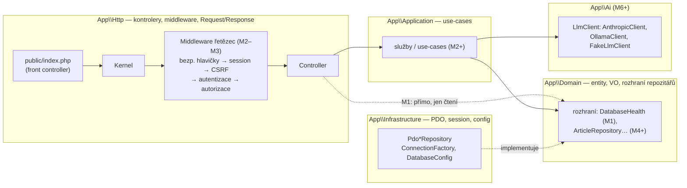
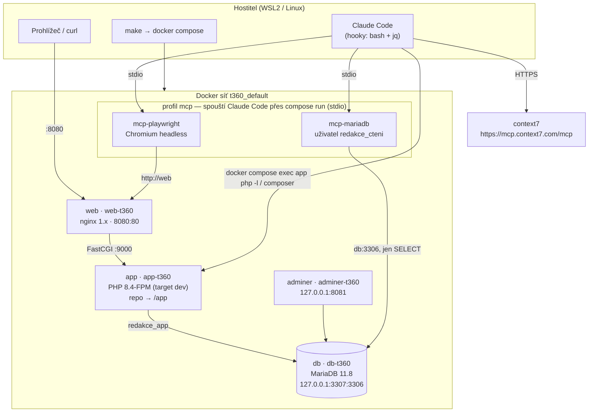
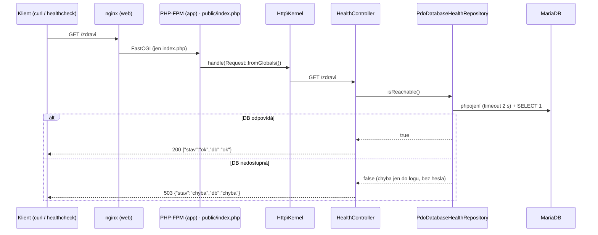

# Architektura — Redakční systém (t360)

> Udržuje agent `architekt`. Poslední aktualizace: 2026-10-03 (plán 001, M1 — stav **návrh**).
> Rozhodnutí: [ADR-0001](adr/0001-vyvoj-tymem-agentu.md) tým agentů ·
> [ADR-0002](adr/0002-vse-v-dockeru-vcetne-mcp.md) vše v Dockeru vč. MCP (navrženo) ·
> [ADR-0003](adr/0003-anglicke-identifikatory.md) anglické identifikátory (navrženo).

## 1. Vrstvy aplikace (cílový stav)
Závislosti míří **dovnitř** k `Domain`. `Infrastructure` implementuje rozhraní z `Domain`.

Stav po M1: existuje jen `Kernel` s pevně zadrátovanou cestou `/zdravi` (router, DI kontejner
a middleware přidá M2), rozhraní `Domain\Health\DatabaseHealth` a jeho PDO implementace.

## 2. Běhové prostředí (dev, `compose.yaml`, projekt `t360`)
Hostitel má jen `docker`, `git`, `bash`, `jq` (+ `make`, `curl` — čeká na schválení). Žádné PHP ani Node.

Uživatelé DB (init skript `docker/mariadb/init/`): `redakce_app` (DML na `redakce` a
`redakce_test`), `redakce_migrace` (DDL), `redakce_cteni` (jen `SELECT`, pro MCP).
Produkce (`compose.prod.yaml`, M9) se řídí skillem `devops-kontrakt` beze změny.

## 3. Tok požadavku `/zdravi` (M1)

## 4. Nástroje kvality (vše v kontejneru `app`)
`make check` = `php -l` + PHP-CS-Fixer `--dry-run` (PER-CS) + PHPStan level max ·
`make test` = PHPUnit (sady Unit, Integration nad DB `redakce_test`) ·
`make qa` = check + test + `composer audit`.
Hooky Claude Code (`php-lint`, `rychla-kontrola`) a git hook `pre-commit` volají tytéž nástroje
přes `docker compose exec -T app …`.
