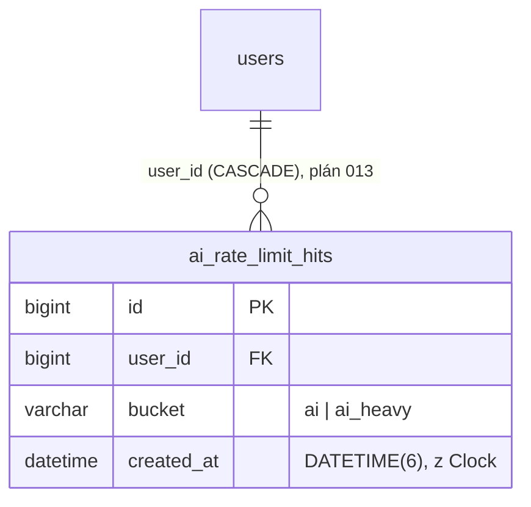

# 013 – Rate limit AI tras v administraci (OWASP LLM10)
Stav: hotovo

- **Milník:** dluh po M6/M7 (backlog M6b z plánu 006, nález 1 revize plánu 010) · **Režim:** výukový (viz `docs/plan/STAV.md`), MVP
- **Autor:** agent architekt · **Datum:** 2026-10-09
- **Souvisí:** [ADR-0013](../adr/0013-rate-limit-ai-tras.md) (navrženo), [plán 006](006-ai-jadro.md) (`MeteredLlmClient`, denní limit,
  `ai_calls`), [plán 008](008-streaming-a-nastroje.md) (06 proud, 07 smyčka), [plán 010](010-ai-redaktor-agent.md) (09, LLM10 v rizicích),
  [ADR-0007](../adr/0007-casy-v-databazi-utc-vs-praha.md) (časy), skill `bezpecnost-owasp` (LLM10: „rate limit AI endpointů (10/min/admin)“)
- **Nová závislost žádná.** Mění se schéma DB (jedna nová tabulka, migrace = `databazista`) a řetěz middleware (ADR-0013).

### Výchozí stav (ověřeno v kódu 2026-10-09)
| Mechanismus | Co dělá | Proč nestačí |
|---|---|---|
| `MeteredLlmClient` + `AI_DENNI_LIMIT_TOKENU` (200 000) | před každým voláním LLM porovná dnešní součet `ai_calls` + `maxTokens` s limitem | limit je **globální pro všechny adminy**: jeden admin (nebo ukradená session) ho vyčerpá klikáním všem; nebrání dávce souběžných dlouhých běhů (09: 3–8 volání, 50–110 s) |
| `ai_calls` | řádek na **jedno volání LLM**, zapisuje se **až po** dokončení volání | neodpovídá jednotce „požadavek“ (09 = až 8 řádků) a běžící požadavky v něm ještě nejsou; embeddingy (08) se nelogují |
| Omezení pokusů o přihlášení | **neexistuje** (backlog M9; `AdminAuthenticator` jen zapisuje `auth.login_failed` do `audit_log`) | není z čeho převzít vzor |
| Zámek nativní session | serializuje požadavky **jedné** session (kromě 06, který zámek uvolní) | druhé přihlášení = druhá session = souběh |
| `Response` | zná stav 429 (`Too Many Requests`), umí přídavné hlavičky | — |

## Cíl
Administrátor může spouštět AI příklady jen přiměřeně často: běžné AI akce nejvýše 10× za minutu, AI redaktora (09) nejvýše 3× za
10 minut. Při překročení dostane srozumitelnou českou hlášku s časem, za který to může zkusit znovu (HTTP 429 + `Retry-After`).
Odmítnutí se zapíše do audit logu. Jeden admin tak nevyčerpá denní limit AI ostatním a nespustí dávku souběžných drahých běhů.

## Akceptační kritéria
Všechna kritéria kromě AC 27 ověří PHPUnit (`MutableClock`, `InMemoryAiRateLimitHitRepository`, falešný klient), grep nebo curl/Playwright
**bez API klíče a bez sítě**. „Běžný“ = kbelík `ai` (výchozí 10/60 s), „náročný“ = kbelík `ai_heavy` (výchozí 3/600 s).

**Konfigurace** (`AiRateLimitConfig::fromEnvironment`)
1. **Given** prázdné prostředí, **Then** běžný limit je `10` požadavků za `60` s a náročný `3` za `600` s (konstanty `DEFAULT_STANDARD = '10/60'`,
   `DEFAULT_HEAVY = '3/600'`).
2. **Given** `AI_LIMIT_POZADAVKU=5/30` a `AI_LIMIT_NAROCNYCH=1/120`, **Then** limity jsou 5/30 a 1/120. Okolní mezery se ořežou.
3. **Given** hodnota `abc`, `10`, `0/60`, `10/0`, `-1/60`, `10/60/5`, `10/86401` nebo `100000/60`, **Then** `MissingConfiguration` jmenuje
   proměnnou (`AI_LIMIT_POZADAVKU`, resp. `AI_LIMIT_NAROCNYCH`) a **neobsahuje** hodnotu. Povolený rozsah: počet 1–9999, okno 1–86 400 s.
4. **Given** `compose.yaml` a `.env.example` čtené jako text, **Then** obsahují `AI_LIMIT_POZADAVKU` a `AI_LIMIT_NAROCNYCH` s výchozími
   hodnotami rovnými konstantám z AC 1 (test proti rozjetí, vzor `ModelDefaultsConsistencyTest`).

**Omezovač** (`AiRateLimiter`, unit, `MutableClock` + paměťový repozitář + `InMemoryAuditLogRepository`)
5. **Given** běžný limit 10/60 a uživatel 1, **When** 10× `consume(1, AiRateBucket::Standard, ip, 'POST /admin/ai/01')` ve stejném okamžiku,
   **Then** všechna projdou a repozitář má 10 záznamů s časem z `Clock`. **When** 11. volání, **Then** `AiRateLimitExceeded` s `retryAfterSeconds 60`,
   `limit 10`, `windowSeconds 60` a repozitář má **dál 10** záznamů (odmítnutí se do limitu nepočítá).
6. **Posuvné okno:** **Given** 10 záznamů v čase t0, **When** hodiny +45 s, **Then** odmítnuto s `retryAfterSeconds 15`; **When** dalších +15 s
   (t0 + 60 s), **Then** projde (okno je `created_at > now − 60 s`). Necelé sekundy se zaokrouhlují nahoru, minimum je 1.
7. **Nezávislost:** **Given** vyčerpaný náročný kbelík uživatele 1, **Then** jeho běžný kbelík projde; **Given** vyčerpaný běžný kbelík uživatele 1,
   **Then** uživatel 2 projde.
8. **Audit:** **Given** odmítnutí z AC 5, **Then** `audit_log` má právě 1 záznam `ai.rate_limited` s `userId 1`, IP z požadavku a shrnutím
   `Limit běžných AI požadavků 10 za 60 s: POST /admin/ai/01`. Povolená volání audit nezapisují.
9. **Given** `AuditAction::AiRateLimited`, **Then** hodnota je `ai.rate_limited`, popisek `Překročení limitu AI` a akce je ve výběru filtru
   na `/admin/audit` (filtr `?akce=ai.rate_limited` projde validací).

**HTTP** (unit přes `Kernel` a `TestContainer`, přihlášený admin, platné CSRF, `AI_PROVIDER` falešný)
10. **Given** běžný limit 2/60, **When** 3× `POST /admin/ai/01`, **Then** první dvě vrátí 303, třetí **429** s hlavičkou `Retry-After: 60`,
    `Content-Type: text/html`, tělo obsahuje „Příliš mnoho požadavků na AI“, „nejvýše 2 za 60 s“, „Zkuste to znovu za 60 s“ a odkaz
    `href="/admin/ai"`. Falešný klient byl zavolán právě 2× (v `ai_calls` 2 řádky). Limit tedy platí i pro falešného klienta.
11. **Given** běžný limit 1/60 a jeden proběhlý `POST /admin/ai/06/proud`, **When** druhý, **Then** 429, `Content-Type: application/json`,
    `Retry-After` a tělo `{"error":"Příliš mnoho požadavků na AI: nejvýše 1 za 60 s. Zkuste to znovu za 60 s."}`. Proud SSE nezačne.
12. **Given** běžný limit 1/60, **Then** do běžného kbelíku se počítají `POST /admin/ai/{example}` (01–05), `/admin/ai/06/proud`, `/admin/ai/07`,
    `/admin/ai/08` a `/admin/ai/08/indexace`: po jednom z nich vrátí kterýkoli další 429.
13. **Given** náročný limit 1/600, **When** 2× `POST /admin/ai/09`, **Then** druhý vrátí 429 (`Retry-After: 600`); `POST /admin/ai/07` hned potom
    vrátí 303 (jiný kbelík).
14. **Uložení a zahození nejsou omezené:** **Given** vyčerpaný náročný i běžný kbelík a návrh v `AiDraftStash`, **When** `POST /admin/ai/09/ulozit`
    s platnými poli, **Then** 303 na `/admin/clanky/{id}/upravit` a koncept je uložený. `POST /admin/ai/09/zahodit` vrátí 303. Žádný z nich nepřidá
    záznam limitu (zaplacený návrh se kvůli limitu neztratí).
15. **Given** 20× `GET /admin/ai/01`, `GET /admin/ai/09` a `GET /admin` (admin), **Then** vše 200 a repozitář limitu je prázdný.
16. **Pořadí middleware:** **Given** `POST /admin/ai/01` s neplatným CSRF, **Then** 403 a žádný záznam limitu. **Given** nepřihlášený
    `POST /admin/ai/01`, **Then** 303 na `/admin/prihlaseni` a žádný záznam.
17. **Given** vyčerpaný běžný kbelík, **When** `POST /admin/clanky/novy` s platnými daty, **Then** 303 (správa obsahu se neomezuje) a repozitář
    limitu nedostal nový záznam.
18. **Záznam vzniká před controllerem:** **Given** `POST /admin/ai/07` s prázdnou otázkou, **Then** 422 a repozitář limitu má 1 záznam
    (zdokumentované chování, viz otázka 6).
19. **Kontrakt tras:** test čte `config/routes.php` jako text. **Then** každá `$router->post('/admin/ai…', [X::class, 'm'])` má handler buď
    v `AiRateLimitMiddleware::LIMITED_HANDLERS`, nebo v `AiRateLimitMiddleware::EXEMPT_HANDLERS` (právě `AiEditorController::save`
    a `::discard`). Každý handler z obou map v `routes.php` existuje. Nová AI trasa bez rozhodnutí o limitu tak neprojde testy.
20. **Given** `config/container.php`, **Then** `MiddlewarePipeline` má pořadí `SecurityHeaders → ErrorHandler → Routing → Csrf → AdminAccess →
    AiRateLimit` (test nad sestaveným kontejnerem nebo grep).
21. **Prohlížeč (06):** `public/assets/ai-stream.js` u odpovědi **429** s JSON zobrazí `data.error` v poli chyb (stejně jako 422), ne obecné
    „Spojení selhalo“.

**Databáze** (integrační, `redakce_test`)
22. **Given** `make migrate`, **Then** existuje tabulka `ai_rate_limit_hits` (`id BIGINT UNSIGNED AI PK`, `user_id BIGINT UNSIGNED NOT NULL`,
    `bucket VARCHAR(20) NOT NULL`, `created_at DATETIME(6) NOT NULL` **bez** `DEFAULT`), index `idx_ai_rate_limit_hits_user_bucket_created
    (user_id, bucket, created_at)`, FK `fk_ai_rate_limit_hits_user_id` → `users(id)` `ON DELETE CASCADE`, InnoDB, `utf8mb4_czech_ci`.
    `migrace:vrat` tabulku odstraní. `SchemaTest` se rozšíří.
23. **Given** `PdoAiRateLimitHitRepository`, **When** `add()` 3× pro (uživatel 1, `ai`) v časech t0, t0+10 s, t0+20 s, 1× pro (1, `ai_heavy`)
    a 1× pro (2, `ai`), **Then** `windowSince(1, 'ai', t0+5 s)` vrátí `count 2` a `oldest` = t0+10 s (s mikrosekundami); prázdné okno vrátí
    `count 0`, `oldest null`. Po smazání uživatele 1 jeho záznamy zmizí (CASCADE).
24. **Given** `EXPLAIN` dotazu `windowSince`, **Then** používá index `idx_ai_rate_limit_hits_user_bucket_created` (zapíše databazista do výstupu).

**E2E a brána kvality**
25. *(curl, falešný klient, výchozí limity)* **Given** přihlášený admin (cookie a `_csrf` ručně dle `tests/E2E-scenare.md`), **When** 11×
    `curl -s -i -X POST -H 'Cookie: …' -d '_csrf=…&article=demo' http://localhost:8080/admin/ai/01` do 60 s, **Then** 10× `HTTP/1.1 303`,
    11. `HTTP/1.1 429 Too Many Requests` s řádkem `Retry-After: <číslo>`; `/admin/audit?akce=ai.rate_limited` ukáže záznam. Playwright: na
    `/admin/ai/06` po vyčerpání limitu ukáže pole chyb hlášku „Příliš mnoho požadavků na AI…“. Scénář běží v sadě **poslední** (blokuje
    adminovi AI na minutu, u 09 na 10 minut).
26. `make qa` je zelené. `tests/E2E-scenare.md` má nový oddíl „Rate limit AI (plán 013)“, README tabulka proměnných obsahuje obě nové proměnné.
27. *(Jen člověk, volitelné)* S `AI_PROVIDER=anthropic` se 4. `POST /admin/ai/09` do 10 minut odmítne **bez** volání API (v `ai_calls`
    nepřibude řádek, náklad 0 USD).

## Návrh

### Rozhodnutí (podrobně v ADR-0013)
| Otázka | Rozhodnutí | Důvod |
|---|---|---|
| **Klíč limitu** | `users.id` přihlášeného admina | Session obejde nové přihlášení nebo druhý prohlížeč. IP v Dockeru obvykle nese bránu sítě (všichni z hostitele mají stejnou `REMOTE_ADDR`) a `TRUSTED_PROXIES` aplikace neimplementuje. ID uživatele je ověřené a nepodvrhnutelné. Globální strop pro všechny adminy už dává denní limit tokenů. |
| **Úložiště** | nová tabulka `ai_rate_limit_hits` v MariaDB | Záznam vzniká **na začátku** požadavku, takže započítá i běžící dlouhé běhy (to `ai_calls` neumí). Jednotkou je HTTP požadavek, ne volání LLM, a počítá i indexaci 08. Bez APCu/Redis (nová závislost). |
| **Algoritmus** | posuvné okno se záznamy (sliding window log): `COUNT(*)` a `MIN(created_at)` za `created_at > now − okno` | Přesný, jednoduše vysvětlitelný v tutoriálu, `Retry-After` vyjde přímo z nejstaršího záznamu: `ceil(oldest + okno − now)`, minimum 1. Odmítnutí se nezapisuje, takže ho opakované klikání neprodlužuje. |
| **Kbelíky a limity** | `ai` (běžný) **10 / 60 s**: 01–05, 06 proud, 07, 08 dotaz, 08 indexace. `ai_heavy` (náročný) **3 / 600 s**: jen 09 návrh. | 10/min ze skillu `bezpecnost-owasp`. 09 stojí ≈ 0,06 USD a běží 50–110 s, 3 běhy za 10 min stačí člověku, který návrh čte a upravuje. Indexace 08 nevolá Claude, ale zatěžuje CPU (Ollama), proto patří do běžného kbelíku. |
| **Výjimky** | `POST /admin/ai/09/ulozit` a `/09/zahodit` se **neomezují** | Nevolají LLM; uložení je nejvýše jedno na návrh (stash se po uložení maže), zápis jde přes CSRF, validaci a audit. Zablokované uložení by zahodilo už zaplacený návrh. GET trasy nikdy nic nevolají. CLI `ai:priklad` a MCP (10) jsou mimo HTTP, viz Mimo rozsah. |
| **Místo vynucení** | nový `AiRateLimitMiddleware` **za** `AdminAccessMiddleware` | Jedno místo pro všech 7 tras, controllery se nemění, 06 dostane 429 **před** začátkem proudu (uvnitř producenta by už šlo jen o SSE `error` po stavu 200). Za CSRF a autentizací, takže cizí web ani nepřihlášený nemůže adminovi limit „vypálit“. Mapuje se podle handleru `[Controller::class, metoda]` z `RouteMatch`, ne podle cesty. |
| **Odpověď** | 429 + `Retry-After: <sekundy>` (RFC 9110, delta-seconds), `Cache-Control: no-store`. HTML šablona `error` (odkaz zpět na `/admin/ai`), u 06 JSON `{"error": …}` | Stejný tvar jako dnešní 422 u 06; JS se rozšíří o 429. |
| **Audit** | každé odmítnutí = `audit_log` akce `ai.rate_limited` (uživatel, IP, shrnutí s kbelíkem, limitem a trasou) | Nová akce migraci nepotřebuje (`action VARCHAR(50)`). Povolené požadavky se do auditu nezapisují (máme `ai_calls`). |
| **Konfigurace** | `AI_LIMIT_POZADAVKU=10/60`, `AI_LIMIT_NAROCNYCH=3/600` (formát `počet/sekundy`), předané v `compose.yaml` `environment:` | Česky jako `AI_DENNI_LIMIT_TOKENU` (zamčený kontrakt). Vypínač se záměrně nezavádí. Testy si limity nastaví přes kontejner. |
| **Falešný klient** | limit platí **stejně** | Stejná cesta kódu, 429 jde ukázat a otestovat bez klíče (AC 10, 25). Falešný klient sice nic nestojí, ale výjimka podle poskytovatele by byla neotestovaný kód pro reálné API. |
| **Čas** | `Clock` (testy `MutableClock`); `created_at` zapisuje aplikace v `Europe/Prague` jako `ai_calls` (ADR-0007) | Okno i `Retry-After` jsou plně testovatelné bez `sleep`. Riziko změny času viz R5. |
| **Souběh** | čtení počtu a zápis nejsou atomické (přijato) | Souběžné požadavky z více session mohou limit překročit nejvýš o počet paralelních požadavků −1. Atomické varianty (zámek řádku `users … FOR UPDATE`, `INSERT … SELECT`) přidávají transakci nebo riziko deadlocku; pro jednoho admina ve výukovém režimu zbytečné (ADR-0013, alternativy). |

### Třídy a rozhraní
| Třída | Vrstva / druh | Podpis a odpovědnost |
|---|---|---|
| `App\Domain\Ai\RateLimit` | `final readonly class` (VO) | `__construct(public int $limit, public int $windowSeconds)`; v konstruktoru kontrola rozsahu 1–9999 / 1–86 400 (`\InvalidArgumentException`) |
| `App\Domain\Ai\AiRateLimitWindow` | `final readonly class` (VO) | `__construct(public int $count, public ?\DateTimeImmutable $oldest)` |
| `App\Domain\Ai\AiRateLimitHitRepository` | `interface` | `add(int $userId, string $bucket, \DateTimeImmutable $at): void`; `windowSince(int $userId, string $bucket, \DateTimeImmutable $since): AiRateLimitWindow` (počítá `created_at > $since`) |
| `App\Infrastructure\Persistence\PdoAiRateLimitHitRepository` | `final readonly class` | PDO, prepared statements, formát času jako `PdoAiCallRepository::formatDateTime` (zóna PHP, mikrosekundy); `windowSince` = jeden `SELECT COUNT(*) AS hits, MIN(created_at) AS oldest … WHERE user_id = :user_id AND bucket = :bucket AND created_at > :since` |
| `App\Infrastructure\Config\AiRateLimitConfig` | `final readonly class` | `public RateLimit $standard`, `public RateLimit $heavy`; `static fromEnvironment(array<string,string>)`, konstanty `DEFAULT_STANDARD`, `DEFAULT_HEAVY`; chyby `MissingConfiguration::invalidVariable()` (AC 1–3) |
| `App\Application\Ai\AiRateBucket` | `enum: string` | `Standard = 'ai'`, `Heavy = 'ai_heavy'`; `label(): string` („běžných AI požadavků“ / „náročných AI požadavků (AI redaktor)“) |
| `App\Application\Ai\AiRateLimitExceeded` | `final class extends \RuntimeException` | `public readonly int $retryAfterSeconds, $limit, $windowSeconds`; česká zpráva `Příliš mnoho požadavků na AI: nejvýše N za W s. Zkuste to znovu za R s.` |
| `App\Application\Ai\AiRateLimiter` | `final readonly class` | `__construct(AiRateLimitHitRepository, AuditLogRepository, Clock, RateLimit $standard, RateLimit $heavy)`; `consume(int $userId, AiRateBucket $bucket, ?string $ipAddress, string $target): void` — spočítá okno, při přečerpání zapíše audit a vyhodí `AiRateLimitExceeded`, jinak zapíše záznam (AC 5–8) |
| `App\Http\Middleware\AiRateLimitMiddleware` | `final readonly class implements Middleware` | `__construct(AuthSession, AiRateLimiter, TemplateRenderer)`; `public const array LIMITED_HANDLERS` (klíč `Třída::metoda` → `AiRateBucket`, příznak JSON jen u `WritingAssistantController::stream`), `public const array EXEMPT_HANDLERS`; jen `POST` s handlerem v mapě a přihlášeným uživatelem, jinak `$next` beze změny |
| `App\Domain\Audit\AuditAction` | změna enumu | nový případ `AiRateLimited = 'ai.rate_limited'`, popisek `Překročení limitu AI` |

Pozn.: `RateLimit` a `AiRateLimitWindow` jsou v `Domain\Ai` vedle `AiCallRepository`. Obecný „RateLimiter pro cokoli“ se nezavádí (YAGNI):
budoucí omezení přihlášení má jiný klíč (IP/e-mail, nepřihlášený) a jde postavit nad existujícím `audit_log` (`auth.login_failed`, `ip_address`,
index `(action, created_at)`).

### Tok požadavku
```
POST /admin/ai/09 (CSRF)
 → SecurityHeaders → ErrorHandler → Routing (RouteMatch: [AiEditorController, 'draft'])
 → Csrf (403, záznam nevznikne) → AdminAccess (303 na přihlášení, záznam nevznikne)
 → AiRateLimitMiddleware: handler v LIMITED_HANDLERS? ne → $next
      ano → user = AuthSession::user()
            AiRateLimiter::consume(user.id, Heavy, clientIp, 'POST /admin/ai/09')
              window = repo.windowSince(id, 'ai_heavy', now − 600 s)
              count ≥ 3 → audit ai.rate_limited → throw AiRateLimitExceeded(retryAfter = ceil(oldest + 600 − now))
              jinak   → repo.add(id, 'ai_heavy', now)
            výjimka → 429 HTML (šablona error) | JSON (06) + Retry-After
            jinak → $next → AiEditorController::draft → Example09 → MeteredLlmClient (denní limit dál platí)
```

### Změny DB (databazista)
Migrace `database/migrations/202610090001_create_ai_rate_limit_hits_table.php` (up + down) podle AC 22. `created_at` bez `DEFAULT`, aby
čas vždy dodal `Clock` (ADR-0007: sloupec plněný aplikací = Europe/Prague). Práva `redakce_app` (DML na `redakce.*`) stačí, init skript
se nemění. **Úklid starých řádků se nezavádí** (otázka 10): jeden řádek na AI požadavek, desítky až stovky denně. Index `(user_id, bucket,
created_at)` drží dotaz rychlý i při desítkách tisíc řádků.



### Zapojení (`config/container.php`)
`AiRateLimitConfig` z `getenv()`, `AiRateLimitHitRepository` → `PdoAiRateLimitHitRepository(\PDO)`, `AiRateLimiter` z konfigurace
a do `MiddlewarePipeline` jako poslední prvek `AiRateLimitMiddleware`. Middleware se sestavuje pro **každý** požadavek: nepřidává nové spojení
(PDO už potřebuje `AdminAccessMiddleware` přes `AuthSession`), ale neplatná konfigurace limitů shodí i veřejné stránky (R6).
`TestContainer::create()` a `withoutSession()` musí **vždy** nahradit `AiRateLimitHitRepository` paměťovým dvojníkem (jinak by unit testy
čehokoli sahaly do DB) a umožnit předat `AiRateLimitConfig`. Výchozí limity v testech zůstávají produkční, testy limitu si je sníží.

### Doporučené commity (každý zelený sám o sobě)
1. `feat(db): tabulka ai_rate_limit_hits pro rate limit AI` – migrace, `SchemaTest`, rozhraní, VO, PDO repozitář a jeho integrační test.
2. `feat(ai): rate limit AI tras v administraci (429 + Retry-After)` – konfigurace, omezovač, middleware, audit, kontejner, compose, `.env.example`,
   JS, testy.
3. `docs(ai): rate limit AI v tutoriálu, README a E2E scénářích`
4. `docs(adr): ADR-0013 rate limit AI tras` + `docs(plan): plán 013 a stav` (vedoucí po bráně 2).

## Dotčené soubory
**Nové, kód:** `database/migrations/202610090001_create_ai_rate_limit_hits_table.php`, `src/Domain/Ai/RateLimit.php`,
`src/Domain/Ai/AiRateLimitWindow.php`, `src/Domain/Ai/AiRateLimitHitRepository.php`, `src/Infrastructure/Persistence/PdoAiRateLimitHitRepository.php`,
`src/Infrastructure/Config/AiRateLimitConfig.php`, `src/Application/Ai/AiRateBucket.php`, `src/Application/Ai/AiRateLimitExceeded.php`,
`src/Application/Ai/AiRateLimiter.php`, `src/Http/Middleware/AiRateLimitMiddleware.php`.

**Nové, testy:** `tests/Unit/Support/InMemoryAiRateLimitHitRepository.php`, `tests/Unit/Infrastructure/Config/AiRateLimitConfigTest.php` (AC 1–3),
`tests/Unit/Infrastructure/Config/RateLimitDefaultsConsistencyTest.php` (AC 4), `tests/Unit/Application/Ai/AiRateLimiterTest.php` (AC 5–8),
`tests/Unit/Http/AdminAiRateLimitTest.php` (AC 10–18, 20), `tests/Unit/Http/AiRateLimitRoutesContractTest.php` (AC 19),
`tests/Integration/Persistence/PdoAiRateLimitHitRepositoryTest.php` (AC 23). Umístění testů podle zvyklostí testera.

**Změněné:** `src/Domain/Audit/AuditAction.php`, `config/container.php`, `templates/error.php` (volitelný odkaz zpět `backPath`/`backLabel`,
výchozí titulní stránka – chování ostatních chyb beze změny), `public/assets/ai-stream.js` (429 jako 422), `compose.yaml` (2 řádky
`environment:`), `.env.example`, `tests/Unit/Support/TestContainer.php`, `tests/Integration/Migration/SchemaTest.php`, testy `AuditAction`
a filtru auditu, `tests/E2E-scenare.md`, `README.md` (tabulka proměnných, „Náklady“), `docs/tutorial.html`, `docs/DEMO.md` (řádek Náklady).

**Po implementaci (architekt):** `docs/architektura.md` (řetěz middleware, ER diagram, odstavec plánu 013), stav ADR-0013.
**Nemění se:** žádný controller, `MeteredLlmClient`, `ai_calls`, `docker/`, `.github/`, `.claude/`.

## Úkoly pro agenty
| # | Agent | Úkol | Výstup | Paralelně |
|---|---|---|---|---|
| T1 | `tester` | Testy napřed pro AC 1–23 a 26: soubory z „Nové, testy“, úprava `TestContainer` (vždy paměťový repozitář limitu, volitelná `AiRateLimitConfig`), `SchemaTest`, testy `AuditAction`. Projít existující unit testy, které v jednom testu posílají víc než 3 POSTy na `/admin/ai/09` nebo víc než 10 na běžné AI trasy (s pevnými hodinami by nově padaly na 429) a zvýšit jim limit přes kontejner. Scénář AC 25 do `tests/E2E-scenare.md` jako **poslední**. | seznam padajících testů a důvod | ∥ T2 |
| T2 | `databazista` | Migrace podle AC 22, `RateLimit`, `AiRateLimitWindow`, `AiRateLimitHitRepository`, `PdoAiRateLimitHitRepository` (signatury z tabulky výše), `make migrate` v dev i test, `EXPLAIN` dotazu `windowSince` (AC 24). | migrace, repozitář, výstup `make migrate`, `EXPLAIN` | ∥ T1 |
| T3 | `programator` | `AiRateLimitConfig`, `AiRateBucket`, `AiRateLimitExceeded`, `AiRateLimiter`, `AiRateLimitMiddleware` (mapy handlerů), `AuditAction`, `config/container.php`, `templates/error.php`, `ai-stream.js`, `compose.yaml` + `.env.example` (jednořádkové výchozí hodnoty, devops netřeba). `make qa`. | diff, výsledek `make qa` | po T1 a T2 |
| T4 | `tester` | Ověření: `make qa`; E2E AC 25 (curl 11× POST, `Retry-After`, audit; Playwright 06), grep `git diff --stat -- src/Http/Controller` (prázdný). | protokol AC 1–26 | po T3 |
| T5 | `security-reviewer` | Krátká revize diffu (doporučeno, otázka 9): pokrytí tras, pořadí middleware, obchvaty (`HEAD`/jiné metody, `/admin/ai/06/proud/`, velikost písmen v cestě, druhá session), souběh, audit, XSS v hlášce a shrnutí auditu. | nálezy podle závažnosti | po T4 |
| T6 | `technicky-spisovatel` | Tutoriál: krátký oddíl „Rate limit AI (LLM10)“ (proč nestačí denní limit, posuvné okno, 429 + `Retry-After`, kbelíky, proč klíč = uživatel, ne IP/session, co se vědomě neřeší), README (proměnné), DEMO (Náklady). | diff dokumentů | ∥ T5 |
| T7 | vedoucí + `architekt` | `STAV.md` (odškrtnout rate limit z M7/M7c/M7d), `architektura.md`, ADR-0013 → přijato po bráně 2. | diff | po T5, T6 |

`ai-inzenyr` úkol nemá: LLM klient, prompty ani `MeteredLlmClient` se nemění. `devops` nemá: změna `compose.yaml` jsou dva řádky výchozích hodnot.

## Rizika a bezpečnost
- **R1 Opomenutá trasa:** nová AI trasa bez záznamu v mapě by limit obešla. Brání tomu kontraktní test AC 19 (POST trasy `/admin/ai…`
  v `routes.php` vs. obě mapy). Mapování podle handleru, ne podle textu cesty, takže obchvat přes `/admin/ai/06/proud/` nebo jinou velikost
  písmen nevznikne: router takovou cestu nenajde (404), handler se nespustí.
- **R2 Souběh (přijato):** počet a zápis nejsou atomické; z N souběžných session lze limit překročit až o N−1. Denní limit tokenů zůstává
  tvrdou pojistkou nákladů. Atomická varianta je v ADR-0013 jako alternativa.
- **R3 Počítá se i neúspěšný požadavek:** 422 (prázdná otázka), 404 (`POST /admin/ai/xyz`) a odmítnutí denním limitem spotřebují místo v okně,
  protože záznam vzniká před controllerem (AC 18). Pro admina je to nanejvýš drobná nepříjemnost, za to je kód jednodušší (otázka 6).
- **R4 Záplava auditu:** každé odmítnutí je řádek `audit_log`. Vyvolat ho může jen přihlášený admin s platným CSRF a rychlost omezuje sám
  požadavek. Agregace („první odmítnutí v okně“) je mimo rozsah.
- **R5 Změna času (ADR-0007):** `created_at` v Europe/Prague. Při podzimním posunu (03:00 → 02:00) může okno hodinu po posunu počítat i řádky
  z „první“ 02:xx, tedy být **přísnější** (fail-closed). Jednou ročně v noci, přijato. Stejné riziko už má denní limit v `MeteredLlmClient`.
- **R6 Neplatná konfigurace = 500 všude:** middleware je v řetězu pro každý požadavek, takže chybná hodnota `AI_LIMIT_*` shodí i veřejný web
  (hláška jmenuje jen proměnnou, `error_log`). Výchozí hodnoty v `compose.yaml` to v praxi vylučují. Líné sestavení by vyžadovalo přístup
  middleware ke kontejneru, a to architektura zakazuje (jen Kernel).
- **R7 Dopad na testy a E2E:** dnešní testy nebo ruční E2E (09 Q1–Q7), které rychle za sebou spustí víc běhů, nově narazí na 429. T1 projde
  unit sadu, E2E scénář limitu běží poslední. Při opakovaném ručním testování 09 lze limit dočasně zvýšit: `AI_LIMIT_NAROCNYCH=20/600 make up`
  (proměnná z prostředí shellu má přednost před `.env`, ověří tester), nebo počkat 10 minut.
- **R8 Ztráta vstupu ve formuláři:** stránka 429 (01–05, 07–09) je obecná chybová stránka a text otázky v ní není. Tlačítko Zpět prohlížeče ho
  obvykle obnoví a 06 (fetch) vstup neztrácí. Vykreslení 429 přímo ve stránce příkladu by znamenalo měnit 5 controllerů (mimo rozsah).
- **R9 Úklid tabulky:** řádky přibývají bez mazání (otázka 10). Odhad: desítky kB za rok provozu, index udrží dotaz rychlý.
- **OWASP / LLM:** **LLM10** neomezená spotřeba (hlavní cíl: limit na uživatele, kbelík pro drahé 09, odmítnutí bez volání API); **A04** nebezpečný
  návrh (limit až za CSRF a autentizací, nejde vypálit cizímu adminovi); **A09** logování (audit `ai.rate_limited`); **A03/XSS** hláška i shrnutí
  auditu skládají jen čísla a pevné texty, výpis přes `e()`; **A05** konfigurace (validace, bez vypínače).

## Mimo rozsah
- Omezení pokusů o přihlášení (zadání, příběh 4) – samostatný plán, nejspíš nad `audit_log` (`auth.login_failed` + IP), bez nové tabulky.
- Limit pro CLI `ai:priklad`, `ai:indexuj` a MCP server (10, nevolá LLM). Kdo má shell v kontejneru, obejde cokoli; denní limit platí dál.
- Globální limit požadavků za všechny adminy, denní limit v USD, limit souběžných běhů (`GET_LOCK`), atomické vynucení (R2).
- `Retry-After` u stávajícího 429 z denního limitu tokenů (`AiBudgetExceeded`) a zobrazení limitů na přehledu `/admin/ai`.
- Vykreslení 429 přímo ve stránce příkladu se zachovaným vstupem (R8); úklid starých řádků (R9); agregace auditu (R4).
- Úprava skillu `bezpecnost-owasp` (odkaz na ADR-0013 a výchozí 10/60) – změna `.claude/` až po souhlasu člověka.

## Otázky pro člověka
1. **Úložiště: nová tabulka `ai_rate_limit_hits` (migrace), nebo počítat řádky `ai_calls` (bez migrace)?** Doporučuji **novou tabulku**.
   `ai_calls` se zapisuje až po dokončení volání (souběžné dlouhé běhy 09 by limit nevšimly), počítá volání LLM místo požadavků (jeden běh 09 =
   3–8 řádků) a neobsahuje indexaci 08. Migrace je malá, vratná a nemění existující tabulky.
2. **Výchozí limity 10 / 60 s (běžné) a 3 / 600 s (09)?** Doporučuji **ano**. 10/min odpovídá skillu `bezpecnost-owasp`, u 09 tři běhy za 10 minut
   stačí na čtení a úpravu návrhu a omezí dávku drahých běhů. Obojí jde změnit proměnnou bez úpravy kódu.
3. **Neomezovat `POST /admin/ai/09/ulozit` a `/09/zahodit`?** Doporučuji **neomezovat**. Nevolají LLM, uložení je nejvýše jedno na návrh a blokace
   by zahodila už zaplacený návrh (AC 14). Pokud chcete omezit i zápis, navrhuji samostatný kbelík jen pro ně, ne sdílený s 09.
4. **Indexace 08 (`/08/indexace`) do běžného kbelíku?** Doporučuji **ano**. Nevolá Claude, ale s Ollamou zatěžuje CPU. Vlastní kbelík by byl
   abstrakce pro jednu trasu.
5. **Má limit platit i pro falešného klienta?** Doporučuji **ano**. Jen tak jde 429 předvést a otestovat bez klíče a reálné API nepoběží
   neověřenou cestou kódu.
6. **Smí se do limitu počítat i požadavek, který skončí 422/404?** Doporučuji **ano** (R3). Kontrola v middleware před controllerem je jedno místo
   pro všech 7 tras. Přesnější varianta (počítat až po validaci) znamená zásah do 5 controllerů.
7. **Zapisovat do auditu každé odmítnutí?** Doporučuji **ano** (R4). Vyvolat ho může jen přihlášený admin a v auditu je vidět, kdo na limit narážel.
8. **Přijmout ADR-0013** (middleware za `AdminAccess`, klíč = uživatel, tabulka v MariaDB, posuvné okno)? Doporučuji **ano**.
9. **Krátká bezpečnostní revize (T5) i ve výukovém režimu?** Doporučuji **ano**: jde o bezpečnostní kontrolu, kterou vyžádala předchozí revize,
   a obchvaty (opomenutá trasa, pořadí middleware, souběh) se nejlépe najdou nezávislým pohledem. Rozsah stačí jedno kolo.
10. **Úklid starých řádků `ai_rate_limit_hits`?** Doporučuji **v tomto plánu ne** (R9). Mazání dat je brána člověka a objem je zanedbatelný.
    Později může přibýt příkaz `bin/konzole ai:uklid-limitu` (smaže řádky starší než den).
